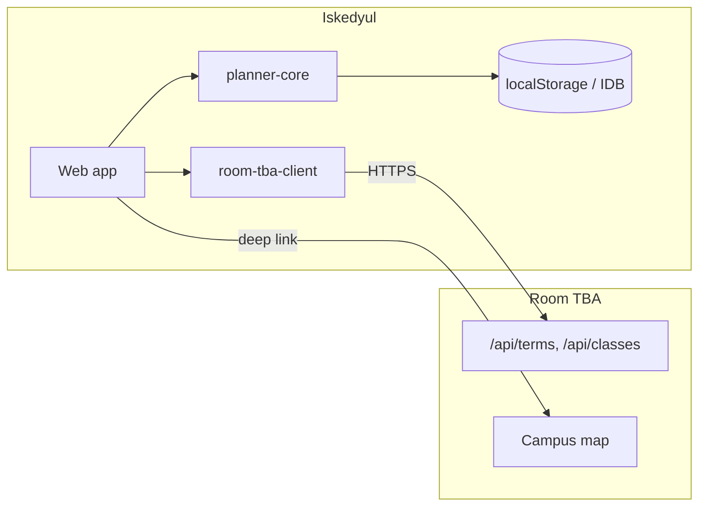

# Implementation plan (tentative)

**Last updated:** 2026-07-03 
**Status:** draft: integration contracts may move as Room TBA APIs evolve.

Iskedyul is a **semester course planner** for UPLB that composes with [Room TBA](https://github.com/uplbtools/room-tba): plan the week here, work through the campus there.

---

## 1. Product goals

### Must have (MVP)

- Select **term** (from Room TBA `/api/terms`).
- **Search** course code → list LEC/LAB sections for that term.
- **Weekly grid** (Mon–Sat, 7:00–21:00 or configurable) with color-coded blocks.
- **Conflict detection** when two blocks overlap in time.
- **Add/remove** sections; persist plan in `localStorage` (one active plan).
- **Deep link** each block to Room TBA room search.
- **Import** CRS/AMIS schedule text/JSON → populate grid (match rows to class IDs).

### Should have (v0.2)

- Multiple named plans ("Plan A", "Plan B").
- **Google Calendar export**: download `.ics` (recurring weekly events, Asia/Manila, room + Room TBA link in description); see [GOOGLE_CALENDAR_EXPORT.md](./GOOGLE_CALENDAR_EXPORT.md).
- Summary stats: units (if derivable), days on campus, earliest/latest class.
- Mobile-first layout; usable at 320px width.

### Should have (v0.3: Room TBA synergy)

- **Day route preview**: ordered stops with map link (port Room TBA schedule-route concept).
- **Finals week overlay** when exam data is available.
- Staging/prod env switch for Room TBA base URL.

### Won't have (yet)

- CRS enlistment or SAIS integration (read-only planning tool).
- Instructor names or ratings (Room TBA deliberately strips AMIS faculty PII).
- Automatic degree-audit / graduation requirements engine.
- Accounts and cloud sync (local-first until demand proves otherwise).

---

## 2. UX sketch

```text
┌─────────────────────────────────────────────────────────┐
│  Iskedyul          Term: [2nd Sem AY 25-26 ▼]  [Import]│
├─────────────────────────────────────────────────────────┤
│  Search: [ MATH 27        ] [+ Add section]             │
├──────────┬──────────────────────────────────────────────┤
│ Added    │  M   T   W   Th  F   S                       │
│ ──────── │  7 ░░░░░░░░░░░░░░░░░░░░░░░░░░░░░░░░░░░░░░░░  │
│ MATH27   │  8 ░░░░░░░░░░░░░░░░░░░░░░░░░░░░░░░░░░░░░░░░  │
│  AB-1L   │  9 ████ MATH27 LAB ████                      │
│  AB-1    │ 10 ░░░░░░░░░░░░░░░░░░░░░░░░░░░░░░░░░░░░░░░░  │
│          │     ...                                      │
│ ⚠ clash  │ 13 ████ CHEM18 LEC ████  ← overlaps MATH     │
├──────────┴──────────────────────────────────────────────┤
│  [ Open today in Room TBA ]  [ Export to Google Calendar ▼ ] │
└─────────────────────────────────────────────────────────┘
```

Interaction principles:

- Clashes are obvious (red border + list in sidebar) but don't block adding: students want to see *how* bad the clash is.
- Empty room → gray block, tooltip explains thesis/TBA sections.
- One tap from block → Room TBA room page.

---

## 3. Architecture



| Package | Role |
| ------- | ---- |
| `apps/web` | SvelteKit or Astro+Svelte UI |
| `packages/planner-core` | Slot parsing, grid placement, conflict algo, **ICS / Google Calendar export**: **pure TS, fully unit tested** |
| `packages/room-tba-client` | Typed fetch, term cache, pagination helpers |
| `packages/schedule-parse` | Import normalizer (shared with Room TBA long-term) |

**Deploy:** Vercel static/SSR for `apps/web`. No Iskedyul database in MVP.

**Stack bias:** Bun + Svelte 5 + TypeScript: aligns with Room TBA for future package extraction.

---

## 4. Core domain model

```ts
type Plan = {
  id: string;
  name: string;
  termId: number;
  addedClassIds: number[]; // references Room TBA classes.id
  createdAt: string;
  updatedAt: string;
};

type GridBlock = {
  classId: number;
  courseCode: string;
  section: string;
  type: string;
  courseTitle: string | null;
  roomCode: string | null;
  day: Weekday; // M | T | W | Th | F | S
  startMinutes: number; // minutes from midnight
  endMinutes: number;
};

type Conflict = {
  classIds: [number, number];
  day: Weekday;
  overlapMinutes: number;
};
```

**Slot parsing:** port/adapt Room TBA `day-stops` logic: handle `Th` vs `T`, combined days (`MWF`), and ranges (`8-9`, `1-4`).

**Conflict rule (MVP):** same `day`, intervals `[start, end)` intersect with ≥ 1 minute overlap.

---

## 5. Room TBA integration phases

See [ROOM_TBA_INTEGRATION.md](./ROOM_TBA_INTEGRATION.md) for API detail.

| Phase | Integration work |
| ----- | ---------------- |
| MVP | Fetch terms + classes; deep links; import row matching |
| v0.2 | CORS or server proxy; IndexedDB cache of class snapshot |
| v0.3 | Finals API; schedule-route handoff URL |

**Cross-repo checklist** (open issues when coding):

- [ ] room-tba: CORS on `/api/classes`, `/api/terms`
- [ ] room-tba: document `ClassMapValue` as public contract
- [ ] iskedyul: proxy route if CORS blocked on first deploy
- [ ] both: extract `schedule-parse` package

---

## 6. Delivery phases

### Phase 0: Data spike (1 session)

- [ ] `room-tba-client`: fetch terms + full class list for current term
- [ ] Log parse success rate: `% of schedule strings → valid GridBlock`
- [ ] Confirm deploy target subdomain + CORS/proxy approach

**Exit:** Script or minimal page loads 3k+ classes and parses ≥ 95% of LEC/LAB slots without error.

### Phase 1: Planner MVP (2–3 sessions)

- [ ] `planner-core` with tests (fixtures from Room TBA `match-classes.test.ts`)
- [ ] Weekly grid component + section search UI
- [ ] Add/remove + conflict sidebar
- [ ] localStorage persistence
- [ ] Room TBA deep links on block click
- [ ] Import panel (paste JSON/text)

**Exit:** Student can build a 5-course plan, see a clash, open a room in Room TBA.

### Phase 2: Polish

- [ ] Multiple plans, rename, duplicate
- [ ] **Google Calendar export**: `buildICS()` in `planner-core`, download button, import instructions; per [GOOGLE_CALENDAR_EXPORT.md](./GOOGLE_CALENDAR_EXPORT.md)
- [ ] Print-friendly week view
- [ ] PWA shell (optional)

### Phase 3: Campus-aware planning

- [ ] "Time to next class" using building coords from Room TBA (needs room→building join or API extension)
- [ ] Finals overlay
- [ ] Share plan via encoded URL (read-only view, no PII)

---

## 7. Testing strategy

| Layer | What |
| ----- | ---- |
| `planner-core` | Slot parser edge cases (`MTWTHFS`, `Th`, midnight boundaries), conflict pairs, import matching, **ICS golden files** |
| `room-tba-client` | Mock fetch; snapshot tests against recorded `/api/classes` fixture (gitignored JSON from staging) |
| Component | Grid renders clash state at 320px |
| E2E (later) | Add section → clash appears → link href points to room-tba.uplbtools.me |

Never call live AMIS or production DB in CI: use Room TBA staging fixtures.

---

## 8. Non-functional requirements

| Concern | Target |
| ------- | ------ |
| Initial load | < 3s on 4G after class cache warm |
| Offline | Show last cached plan + banner "class data may be stale" |
| Privacy | No enrollment data sent to server in MVP |
| Accessibility | Grid navigable via keyboard; conflicts not color-only |

---

## 9. Open questions

1. **Domain:** `iskedyul.uplbtools.me` vs path on `room-tba.uplbtools.me/planner`: separate app keeps bundle small but splits UX.
2. **Class snapshot size:** ~3k rows/term: full fetch OK or require server-side search only?
3. **Units / prerequisites:** do we have reliable credit data in AMIS imports, or skip until manual GE checklist?
4. **Midyear intensive blocks:** `MTWTHFS 7-12` spans: same parser rules as Room TBA schedule route?
5. **Coordination owner:** who merges CORS change in Room TBA before public Iskedyul launch?

---

## 10. Next actions

1. Phase 0 spike issue in this repo.
2. Room TBA issue: CORS + public API contract doc (may be a README section in room-tba).
3. Copy 20 schedule strings from staging into `planner-core` test fixtures.
4. Wireframe mobile grid in issue attachment.

---

*Plan intentionally overlaps Room TBA's existing schedule-import work: reuse, don't fork permanently.*
